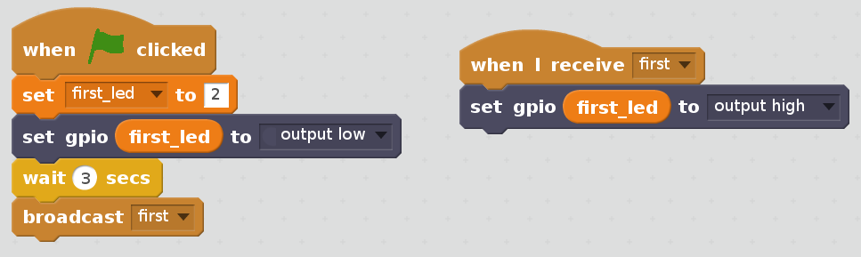
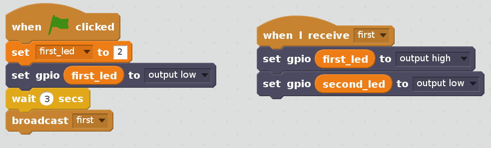
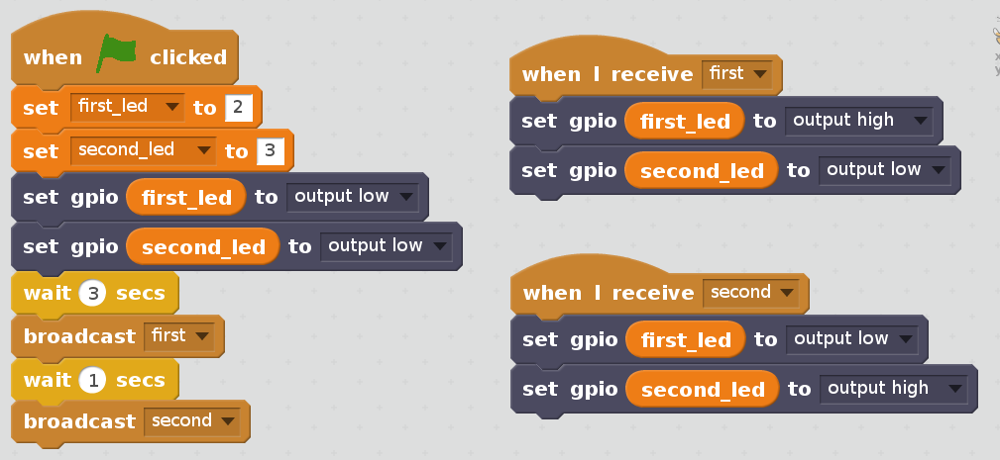
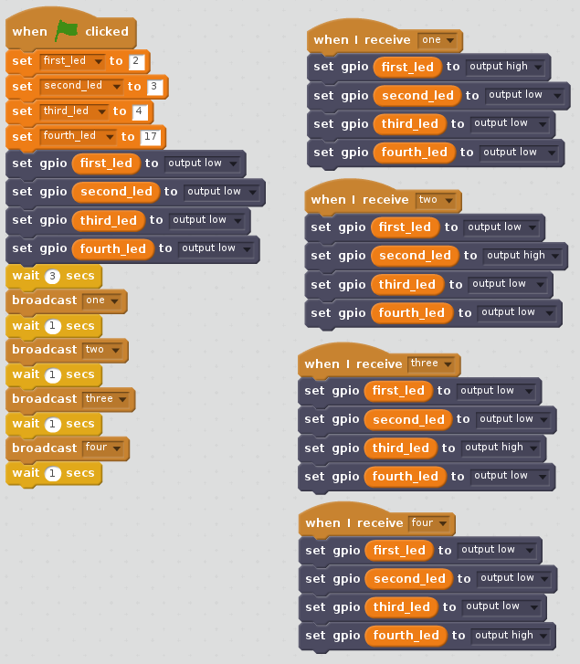

# LED-Chase-in-Scratch2
Program in Scratch a series of LED on a breadboard to flash in a sequence. This idea stemmed from the finding that children 
didn't understand traffic lights. The flashing sequence meant nothing to them. So this extends the number of lights to flash
and adds a different effect. Think KITT car from Nightrider. But that reference is also lost on most people too!

# LED Light Chaser with Scratch2

In this exercise you will build a circuit of lights using LED, connect them to the Raspberry Pi computer and control 
the sequence that the lights illuminate.

## Start to Build

The diagram shows the layout of the first LED. The pins on the Raspberry Pi are in the same orientation as the PiTop. 
Use the pin numbers on the identification or count in from the end. The first LED is connected to ground and Pin 2.

The LED must be placed in the correct way round with the shorter leg (cathode) in the same column as the resistor. 
If the LED doesn’t light up later on it could be that the LED is just in the incorrect way round.

## Starting to Code
To program the LED to turn on and off you shall be using a version of Scratch2 for the Raspberry Pi. 
This version allows the controlling of the pins that you have connected the LED to above.

From the Main Menu, Programming open Scratch2. The first thing to do is access the More Blocks extension for the Raspberry Pi.

Click on More Blocks and on the page that opens click on the Pi GPIO and then OK. The new blocks shown should then appear.

In Scratch all the coding is done with blocks that fit together like a jigsaw puzzle. If they will not fit then then 
Scratch is telling you that you are doing it wrong.

Each set of blocks has a different colour. Select the correct series of blocks just by looking at what colour they are.

Start by first selecting the Data blocks. Click on “Make a Variable” and name it as “first_led”.

This name is just a name and could be anything such as “red_led” if it was red, or “red_light” or in fact “yellow_banana”. 
But it is best to call it something useful and relevant. 

The first set of blocks that need to be placed are in the above picture. The block on the right is trying to show how to 
change the values in these blocks by clicking on the small arrow. A menu appears and then either select the one you want 
or type a new one.

The most important thing to notice is the “output low” with the small arrow beside it. By clicking on the arrow you can 
select “output high”. The difference is that high means on and low means off. Switching from high to low switches the LED 
on and off. By getting Scratch to use high and low at the right times makes the LED flash. It really is that simple.

Click on the green flag block and the code will run. What should happen is that the led on the board should be off 
then switch on. Your code does not have any instruction to switch off unless the code is rerun. Try it.

## Another LED
So now add another LED and resistor to the board. In much the same way as before connecting it to pin 3. Just follow the picture.

The code for the new LED is very similar to the first. Add the new code to the blocks you already are using. 
The picture shows all the blocks that are needed to light both LED up, one after the other.

Run your code again and see if it works.

## A Third and Fourth LED
You might be getting the hang of this now. So try adding two more LED to the board to pins 4 and 17. Strange jump in 
numbers but that is just the way it is!

And the code is very much the same only more of it.

### A Quick Cheat!
To make it easier you can copy code you already have by right clicking on the blocks and selecting “duplicate”. 
Then just alter the values.

Here is the code. This should get all the LED lighting up. All the basics of the code to play with is now here. 
Run the code to see.

## A Forever Loop
Now is the time to add a block of code to make the lights repeat their pattern again and again. Find the “forever” 
block and wrap it around the four “broadcast” blocks with an extra “wait” added at the bottom.

## Ready for a Challenge?
Can you make the lights flash faster?

Can you make the LED bounce back and forwards along the line? At the moment it is always from left to right. 
Can you make them go left to right to left?

Can you make up a new pattern of flashes that we have not told you about?
